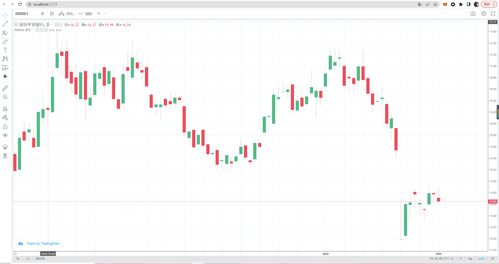
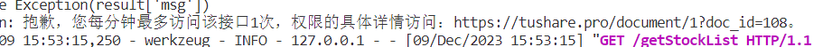

# 预览



# 启动 vue 前端

进入前端文件夹

```sh
cd .\frontend\
```

## 下载依赖

```sh
npm install
```

### 启动

```sh
npm run dev
```

打开 http://localhost:5173/

具体查看前端 README

# 启动 python+flask 后端，由于没有使用数据库，查询次数有限

进入后端文件夹

```sh
cd .\backend\
```

## 下载依赖

```sh
pip install
```

### 启动测试数据

```sh
flask --app test run
```

### 启动正式数据

```sh
flask --app app run
```

# 报错,因为 tushare 积分不够，可能展示不出来，将 app.py 中的 token 换成您自己的 token，或者启动 test.py 测试数据！



###

具体查看后端 README
