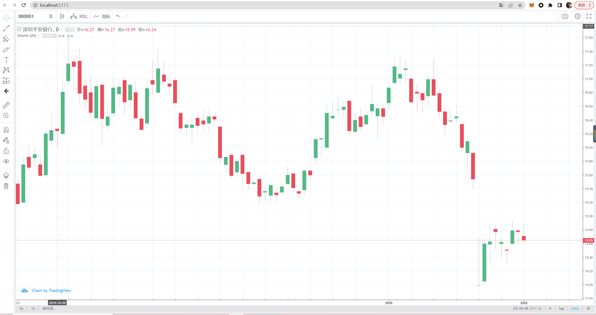

# 启动vue前端

进入前端文件夹
```sh
cd .\frontend\
```

## 下载依赖

```sh
npm install
```

### 启动
```sh
npm run dev
```
打开http://localhost:5173/

具体查看前端README

# 启动python+flask后端，没有使用数据库

进入后端文件夹
```sh
cd .\backend\
```

## 下载依赖

```sh
pip install
```

### 启动测试数据

```sh
flask --app test run
```

### 启动正式数据，因为tushare积分不够，可能展示不出来，将app.py中的token换成您自己的token，或者启动test.py测试数据！

```sh
flask --app app run
```
具体查看后端README
